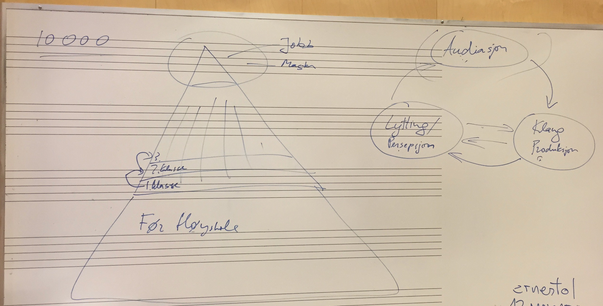
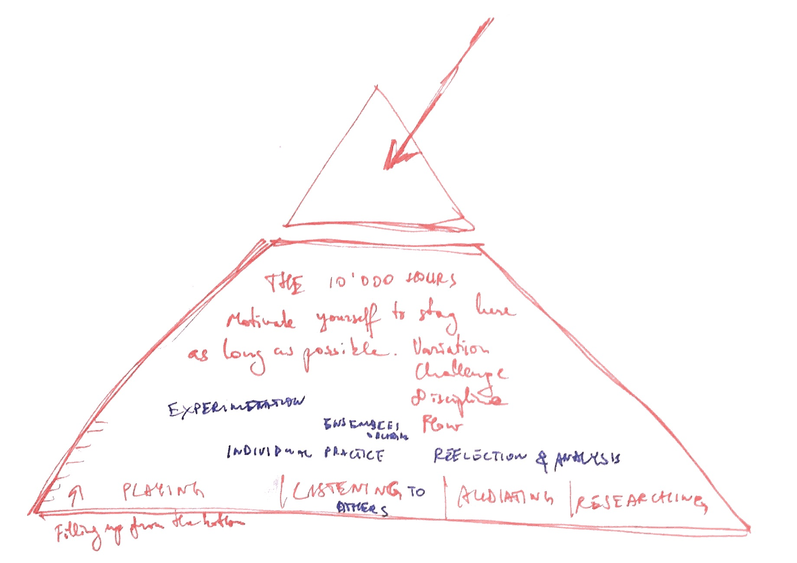

> We overestimate what we can do in a day and underestimate what we can do in a year. Author???

Image of where a student is in the process to become a professional.

Low in the trajectory: non linear path
