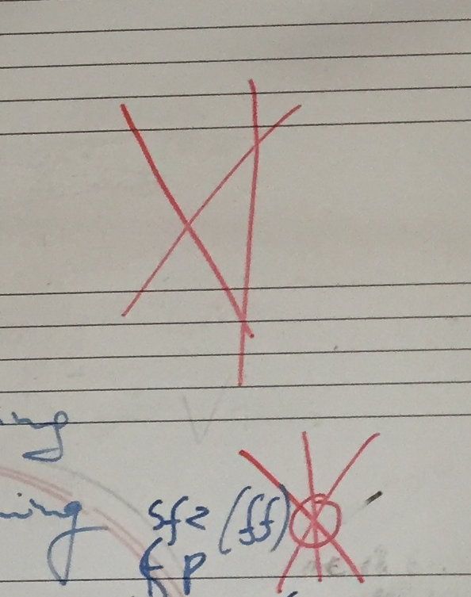

Synonyms: diction

## Blowing fast, blowing slow

- Fast air and articulation
- Air before tongue
- Consonant before the beat

- Ikke spytt. Spitting tone out
- Diction, not tonguing

## Other

Tu-Ta are wrong ways to think; engaging the instrument, contact with the resistance.

No spitting

## Double-triple tonguing

- Long vowels

## Fast repetition
- Small and light tongue action/movement
- Constant uninterrupted air stream, glued contact with the resistance
- No spitting, No ricochet
- Awareness of the primary control

- Effortlessness and tennis ball, simple

## Aligning three dimensions

A way of thinking articulation. A three-fold aiming:
1. Air speed
2. Tongue action
3. Lip precision centering
4. Listening
5. Audiation  
