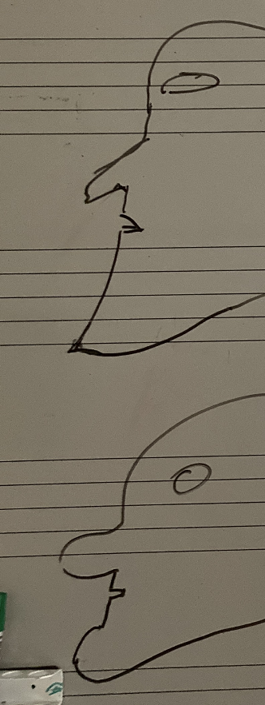

You have to figure out how to activate muscles of the face to make make a pointy chin. This requires that you have good coordination of muscles and manage to activate different muscles separately. It is important that you [Relax into position](../relaxing-into-position)

## Rolled up vs pointy chin

The opposite of a pointy chin is a chin that rolls up and is soft.

## Ideas

- Length between the lower lip and the chin
