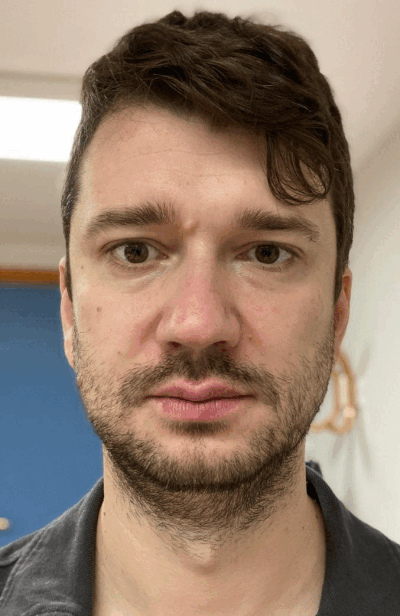
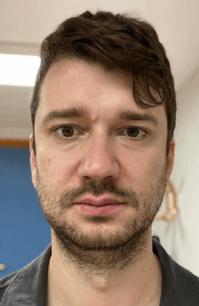

## Structured Embouchure
- firm vs tense
- lips should direct the air: air stream goes straight/forward (not up or down)
- whistling embouchure
- pronounce sound Ü

| Enough Shaping  | Too much shaping   |
|---|---|
|  |   |

## Other ideas

- both lips visible. Do not let the lower lip scoot under the upper-lip (might need to roll out the lips slightly)
