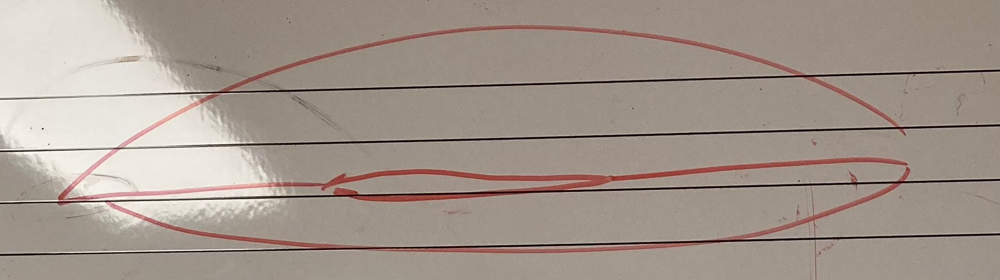
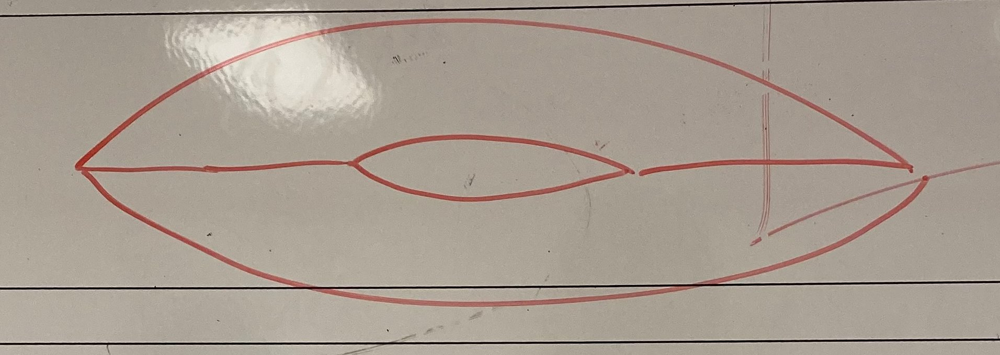
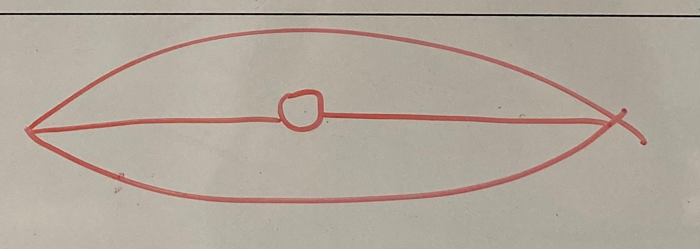
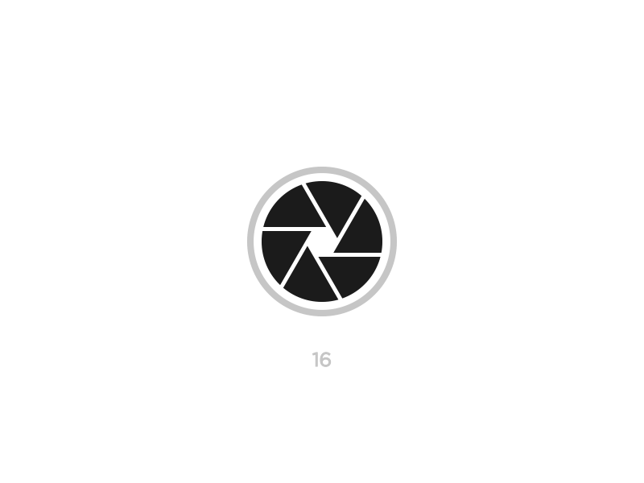
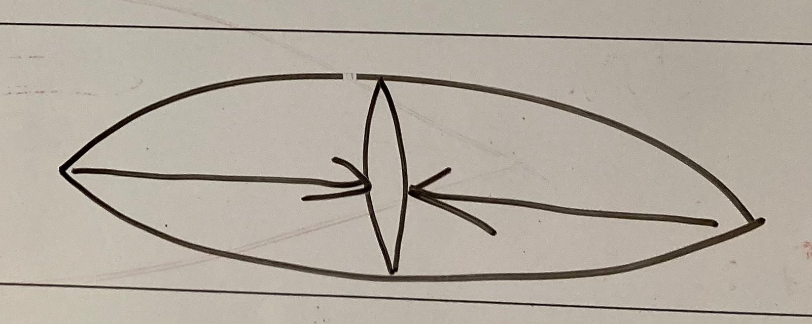

Here are some examples of optimal and less optimal aperture formations. These pictures are about how you should *think* aperture, in reality it will look somewhat different. If you think Nr. 4, then your actual embouchure will look something like Nr. 2. But if you think Nr. 2 then the embouchure will resemble Nr. 1.

## 1. Flat aperture - Poor

## 2. Semi-Flat aperture - Poor

## 3. Round aperture - Good

You can imagine an aperture in a camera lense.

## 4. Tall, thin, vertical aperture - Good

