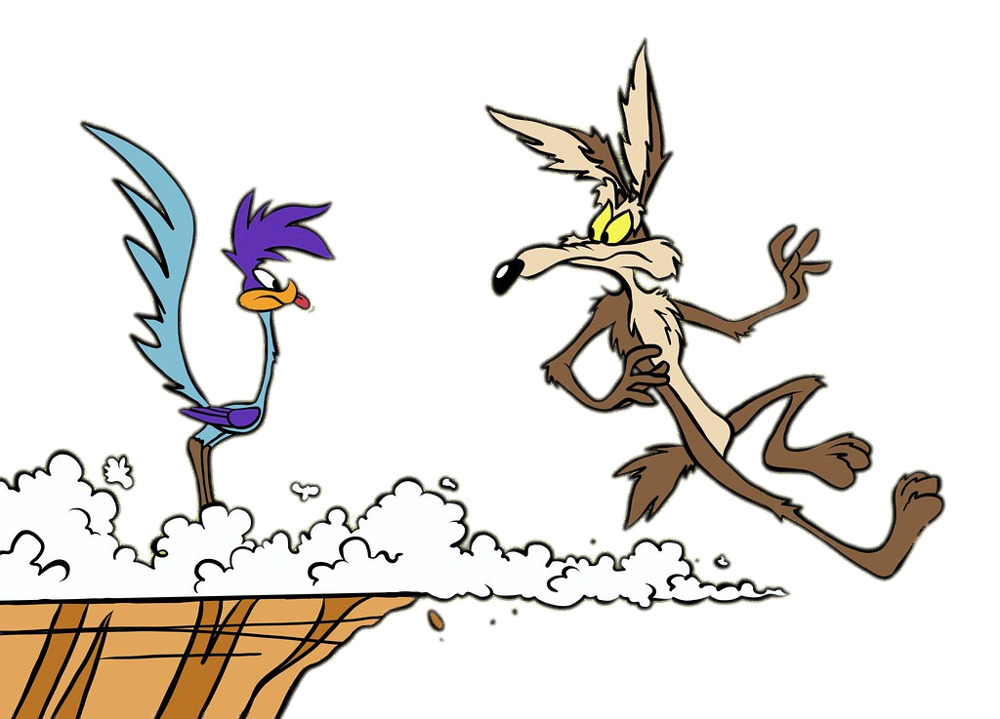

[Changing the fingering from long to short]() often feels like the ground has disappeared from under your feet.

It's as if you run on a solid ground, and all of the sudden you loose the support, aptly illustrated by Looney Tunes characters.

Once your body realises it cannot lean against instrument's resistance, it triggers a compensatory tightening of some muscles (throat or chest).

After a few times, this compensatory response becomes a normal way of playing: slightly tighter than necessary.
Only because the body sometimes freaks out that resistance is gone. I call this habit "The Fear of Falling".

## The Fear of Falling

- Absence of trust (in resistance; in support)
- Leaning requires trust

## Shock absorber (Støtdempere)

- Being glued to resistance
- Underblowing
- Overblowing

Anticipate the changes and prepare for new resistance level, like you prepare for a new pitch.

Coming to terms with the resistance

## The fear of falling (and trusting the resistance)
Leaning

Blind blowing

Topology of the resistance

Blowing blindly
Loosing contact with the resistance and the ricochet.

Even air stream??? Air column, air stream

Respecting the tube

## Fear of falling

## Leaning. Trust the horn!

Like a wall

## Literature and other sources

Notice how the instrument responds what you are doing - A feedback system

Respecting the tube

Blind Blowing

Leaning

Expanding instrument's walls, blowing to the end of the instrument

The different levels of resistance feel like different "depths of the instrument"

## Resistance and leaning
Elastic resistance
Softening resistance
Getting acquainted with the resistence

## Vertical geografi/topografi/examination of the depths
“dybde” av motstand
Og kjennskap til dybde/topografi

## Senstivity to the instrument’s resistance

Myk kontakt med motstanden. We don’t want to overblow or underblow and it’s important to be playing the instrument that you have and be sensitive to the resistance. Playing your own horn

- Evening out resistance
- “Carrying air”

- Not overblowing: Nudging air intensity
- Overblowing and under-blowing. And their coexistance. Different fingerings, different blowing requirements
