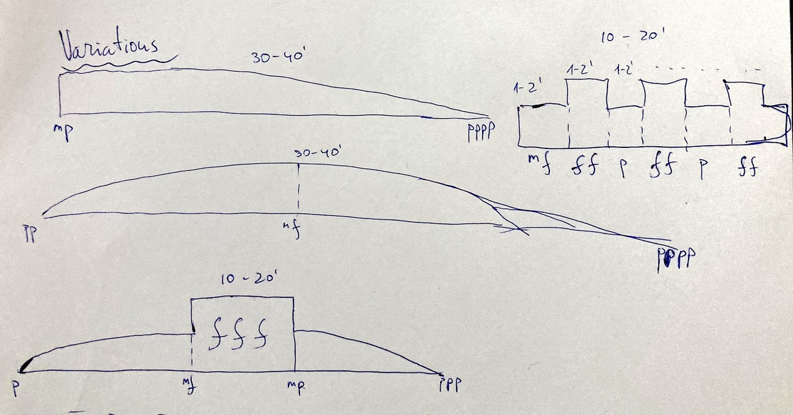

Most of the literature on horn playing recommend practicing long tones. The exercise
is considered to be one of the most important one's. It helps you to develop sensitivity to
how you produce sound, becoming mindful of minute details.

## Goals of exercise

- Length of Exhalation: Do not overdo this! 45-60" is a maximum, depending on your lung capacity
- Staying Calm: learn not to panic when the body goes low on oxygen. Stay in control
- Smooth embouchure transition between different dynamics
- Intonation Control: make sure you keep the pitch steady as the dynamic and the amount of air in your lungs change.
- Developing Strength: long tones are good for developing both static and explosive strength (see variations).
- Developing nice taper at the end: fade out as controlled as possible
- Audiation: constantly imagine the next step in sound development (think of the next beat)
- Sound Quality: aim for a dark, rich, centered sound (or whatever sound you find beautiful)
- Stability of the Sound: make sure the sound has a steady core
- Work on technique:
  - Resistance Sensitivity
  - Structure Embouchure
  - Engage Trunk
  - Experiment with different parameters

## Exercise
1. Select a pitch
2. Hold it for 20-45" (seconds), or as long as you can (do not overdo)
3. Take a 10-30" break
4. Repeat

## Taper

Tapering, or rounding off, the tone at the *very* end can be achieved by almost an increase of air speed. As if you blow the note out into the room. You can think of an airplane that is about to land: it speeds up right before touching the runway. Apply same idea for "landing" the long tones.

## Variations

### Pitch
There are many ways of selecting next pitch:
- chromatic
- diatonic
- "Christmas tree" - one step up, one step down, two steps up, two steps down etc
- Circle of Fifths
- Random

### Shape

### Intensity

Long tones can be both high and low intensity exercise. For low intensity, keep
the dynamics soft in the mid/low range. Aim for 30-40' seconds. To increase the
intensity, use extreme dynamics. Use explosive elements (see Shape).

### Similar exercises

### Karl Biehlig: Kompendium der Horntechnik

### 1 Ausgehaltene Töne

> Für viele gehört Töne aushalten zu den langweiligsten Übungen; dennoch ist es für Hornisten unerläßlich.

> **Beachte:** Je ausgewogener die Stütze und je mehr sich die Luftwege weiten (aber ohne "den Hals aufzublasen"!), desto tragfähiger und modulationsfähiger wird der Ton.
>
> - _praktiziere den druckschwachen Ansatz!_
> - _halte jeden Ton etwa 30 Sekunden aus und laß ihn so leise wie möglich erklingen!_
> - _stoße jeden Ton akkurat an, hauche nicht nur!_
>
> _und vor allem_
>
> - _horche dir sorgfältig zu!_
> - _laß dich nicht ablenken und blase nicht lustlos oder mechanisch!_

Impact

## Focus 1: Length of breath

- Practice holding a long note as long as you can
  - 30 sec hold, 10 sec rest
  - 45 sec hold, 30 sec rest

## Focus 2: Resistance sensitivity

## Focus 3: Dynamic variation

Different shapes, over

- make sure to keep intonation the same, as you change the dynamics
