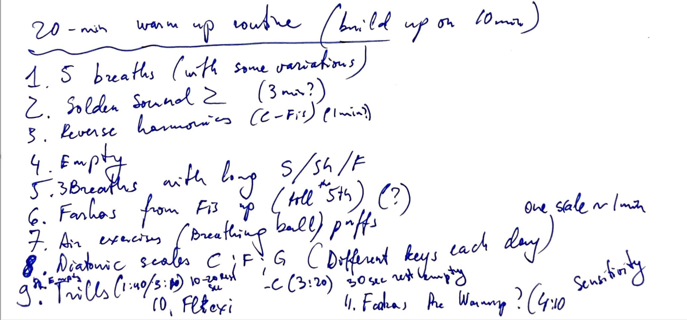

⬇️ [Download the routine](./5-minute-warm-up-routine.pdf) (TODO)

## The Routine

1. Empty the Horn
1. Deep breath & Sigh x3
1. Deep breath & Sizzle or Sh-sh-sh
1. Golden Sound 2 (3 min) (G'-C'') upwards
1. Reverse Open Harmonics (C''-Fis') downwards
1. Empty the Horn
1. 3x Breath with long s-s-s and sizzle
1. Farkas Warm Up from Fis to C or F (up to the octave and fifth)
1. Breath: Breathing ball, or air puffs
1. Diatonic scales C,F and G (different key each day) 1 scale ~1 min
1. Empty the horn
1. Trills C'' to Fis'
1. Flexi Open Harmonics
1. Farkas Pre-Warmup

## Reminders

Practice the [Atomic Habits of Efficient Technique]()

## Video

Coming soon

## To Process

