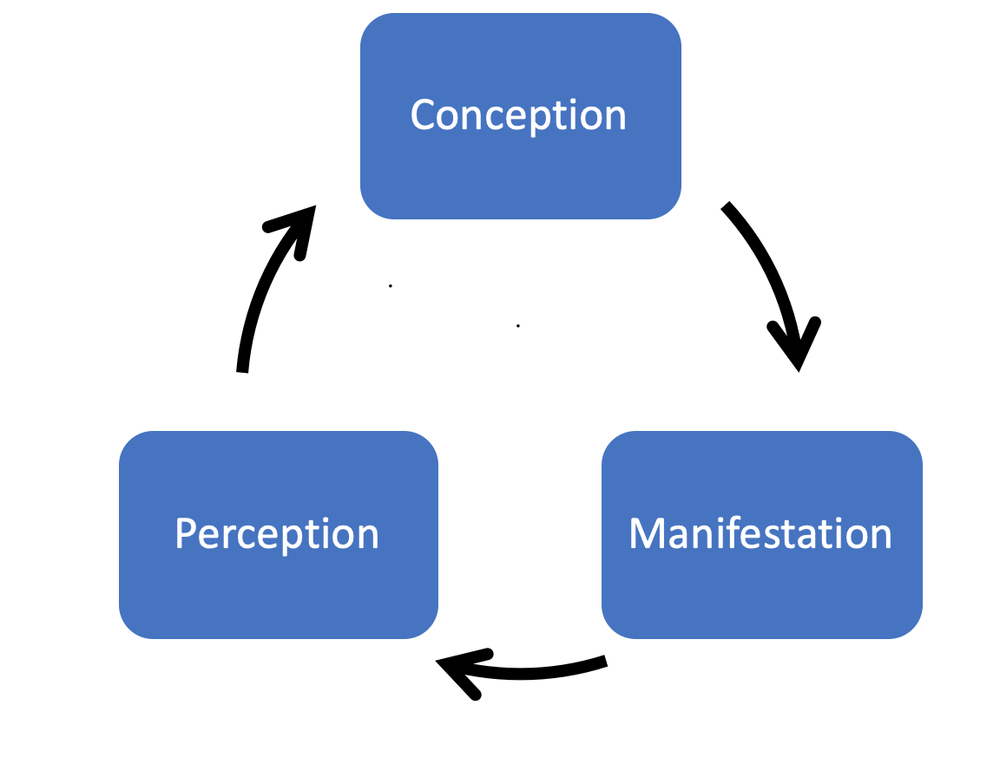

## Having grasp of the instrument

- Knowing how the instrument works
- Knowing how to operate it
- Knowing the issues and how to solve them

## Model of Action

Always already in action
Practicing is about directing the course of an always ongoing action
Developing Geography of Action. The structuring the potentialities of the unfolding action.
Philosophy of being. What is it to be?
Horn geography

Conception - conceiving of the future result (future state) of an action. It can have different qualities, properties, different geographies, different modes

Perception has modes.

Manifestation (modes): movement, reaction, executing (action),

Conception/Perception/Manifestation have modes. Audiatory direction, physically based geographic direction, visual

Flow; facilitate creation of geography.
This is perceivable by the audience.

Action produces residue in form of memory; Action is fed by memory residues.
Memory and habit
